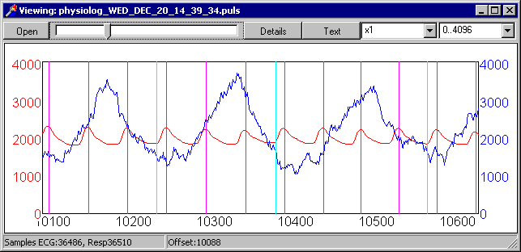
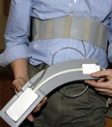
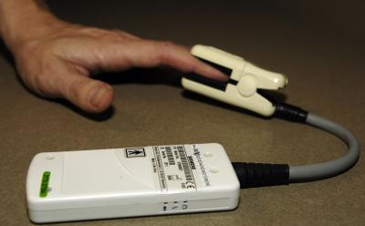

## Physiological Artifact Removal Tool (PART)


Physiological cycles such as breathing and heart rate can add noise to 4-dimensional MRI data. For example, voxels in a fMRI acquistion may become brighter or darker depending on the cardiac phase. The statistics used to analyze fMRI data is based on the ratio of predicted signal versus noise, so if we can reduce the noise in our data, we can effectively increase our ability to detect brain activation. At first glance, one would think that you could simply apply a ‘notch’ filter to eliminate the frequency of the noise we are interested in. For example, the fMRI signal has a cycle of ~0.04 Hz (6 sec to peak, 12 sec to baseline, 18 sec maximum undershoot and 24 sec back to baseline) while the heart rate is about 1 Hz and the respiration cycle is about 0.3 Hz. Indeed, for block fMRI designs, I recommend applying low pass temporal filtering to your data (this option is on the ‘pre-stats’ tab of FSL’s FEAT). However, there are two reasons why this solution is less than ideal. First, with event related fMRI designs, some of the signal may be at higher frequencies. Second, we have the problem of  [aliasing](https://en.wikipedia.org/wiki/Aliasing) – if a frequency is faster than half our sampling rate, it can appear as a slower frequency (the Nyquist theorem). Aliasing is the reason that wheels can appear to move backwards when we watch TV: the TVs 60Hz sampling rate is too slow for the wheel’s angular rotation. For example, consider if we sample a signal at 1.5 times it’s period. In the graph below the black line shows the actual signal fluctuation, while the red dots show our samples. Observing our samples, we would infer that the signal was half it’s actual frequency.



 -  Note that with fMRI we typically observe a voxel of the brain around every 2-3 seconds, slower than the critical  [Nyquist frequency](https://en.wikipedia.org/wiki/Nyquist_frequency) for cardiac and respiration. If we sample every 2 seconds, we can not observe frequencies with a period shorter than 4 seconds, while the heart rate is approximately once every second. In short, physiological artifacts can add noise that reduces our ability to detect brain activation. This problem is especially acute for resting state fMRI, where aliased physiological signals could mimic real activation(while with standard fMRI we are phase locking the signal to external events, so physiological signals may reduce our ability to detect signals but should not cause false alarms). There are a couple of solutions that can help reduce the effect of physiological noise:
 - Measure physiological cycles during the MRI scan, and then retrospectively remove changes in image intensity that are phase-locked to the physiological cycle. Note that the physiological variables can either be covaried out during analysis [Corfield et al. 1999 ](https://pubmed.ncbi.nlm.nih.gov/10233106/)) or by preprocessing the data.Examples of this latter method have been described by [Glover et al. 2000](https://pubmed.ncbi.nlm.nih.gov/10893535) and  [Deckers et al., 2006](https://pubmed.ncbi.nlm.nih.gov/17011214). Perhaps the most popular algorithm is Glover’s RETROICOR, which is inlcuded as a plugin for [AFNI](https://afni.nimh.nih.gov/pub/dist/doc/program_help/3dretroicor.html). Below I describe the tools I (Chris Rorden) created to conduct a sophisticated form of retrospective correction.
 - Acquire volumes faster than the nyquist frequency, in other words have a TR less than 0.5sec. For example [Anand et al.2005](https://www.nature.com/articles/1300725)use a TR of just 0.4 sec, collecting just four slices. This approach does include drawbacks – the short TR means there will be very little signal to measure (as there is little T1 recovery), furthermore, the small number of slices acquired necessarily mean you will only see a small part of the brain (and you can only observe effects in parts of the brain that you measure), furthermore, the small number of slices means you can not normalize your images to conduct conventional group analyses. Therefore, while this is an excellent way to model and eliminate physiological noise, it requires careful analysis – the paper by Anand et al. demonstrates how careful region of interest analysis can effectively use this technique.
 - The whole brain’s fMRI signal fluctuates with physiological (respiratory) cycle. Therefore, one approach is to model this effect as a regressor in your analysis (`Birn et al. ()2006 "https://pubmed.ncbi.nlm.nih.gov/16632379>`). This might be a useful technique for resting state fMRI. However, for event-related fMRI or situations where large portions of the brain cycle together, I wonder if this approach might have some of the drawbacks as [global scaling](https://imaging.mrc-cbu.cam.ac.uk/imaging/PrinciplesStatistics#Global_image_signal).
 - Acquire data with the acquisition gated to the cardiac cycle. Unfortunately, with this method the TR (time between volumes) varies between volumes, so the signal (T1-effects) would also change. You would be replacing one type of noise with another. In theory, you can model the known modulation in TR. Florian Beissner notes that there are several implementations for this approach:
 - Sparse sampling to let the signal return to its equilibrium after each excitation ([Griffiths et al.](https://pubmed.ncbi.nlm.nih.gov/11369945)), albeit this means fewer observations and therefore less statistical power.
 - Modeling and correcting T1 effects with a previously acquired T1 map ([Guimaraes et al.](https://pubmed.ncbi.nlm.nih.gov/9673661)).
 - You can acquire two echoes instead of one and simply remove the T1-related part of the signal by quotient formation or direct calculation of T2* ([Zhang et al.](https://pubmed.ncbi.nlm.nih.gov/16624588);  [Beissner et al.](https://pubmed.ncbi.nlm.nih.gov/21256220)).
 - While conventional fMRI scans take around 2-4 seconds per volume, the amount of time to collect each slice is around 50-100ms. In theory, it should be possible to use the 3D information to both infer and remove physiological artifacts. This would be a truly elegant solution, as it would not even require physiological monitoring. While this option has been discussed in  [theory](https://sscc.nimh.nih.gov/sscc/rwcox/coxbrainblog/blogentry.2005-12-23.6999344505), I do not know of any implementations.

Introspectively, one might think that heart rate has a larger influence on fMRI signal than respiration (as fMRI measures changes in blood flow). However, the reverse is true: heart rate only has localized effects due to the blood vessel’s [pulsatility](https://www.ncbi.nlm.nih.gov/entrez/query.fcgi?db=PubMed&amp;cmd=Search&amp;term=10191169>`_, while respiration tends to correlate with head motion that influence the magnet’s homogeneity typically resulting in global effects.

##### Installation and Compiling

You can build these tools from the command line, assuming you have [Lazarus](http://www.lazarus-ide.org) installed.

```
lazbuild -B part.lpr
```

#####  Usage



I have adapted a simple technique described by Deckers (see above) to reduce physiological noise. This alogorithm divides the period between successive pulses/breaths into a number of bins. The observed data is then classified according to which bin it is closest to. The mean signal for each bin is computed, and this observed fluctuation is then removed from the data. Following Deckers, my software uses 40 bins for cardiac data and 20 bins for respiration bins. Deckers. In the algorithm specificied by Deckers, the bins span the mean physiological period plus two standard deviations (in other words, if the mean time between cardiac pulses is 1.02sec +/-0.1sec, then the bins span 1.22sec). In my algorithm I use the Median plus 1.5 inter-quartile ranges. I did this as participant movements in the scanner can lead to sensors failing to detect a few heart beats – and the mean and standard deviation are influenced by these missing samples. Furthermore, my software will interpolate up to two missing heart beats.


To use my software you need to record the pulse and/or the respiration. This is easy to do with modern Siemens scanners, which can generate recording files named ``*.puls`` and ``*.resp`` (Philips scanners can collect .log files). With other scanners, you can use my software if you generate FSL-format 3 column text files where the first item in each column reports the physiological trigger time (e.g. 0.12 1 1 1.21 1 1… if the first heart beat occurred 0.12 seconds after MRI acquisition and the second pulse occurred 1.21 seconds into the recording). Below is a sample of my own breathing (blue line) and heart rate (red line), with the triggers shown in magenta (heart) and cyan (breathing).

 Here is what you will need to run my software:
 
 - Your physiological data (either Siemens .puls/.resp, Philips .log or FSL 3-column text files).
 - Your MRI data (a 4D NIfTI image).
 - My software currently assumes ascending acquistion with continuous sampling (e.g. do not use this with sparse fMRI).
 - Your data should be motion corrected prior to physiological correction (e.g. use FSL’s mcflirt).
 - A copy of my (Chris Rorden) PART software.

Running the `part` software from the command line with no parameters provides the following instructions:

```
Usage: part [options] input.nii
Version: 14 Feb 2015 by Chris Rorden 64-bit
 Uses Siemens PULS/RESP data to remove variance in NIfTI images.
 For details, see Deckers et al (2006) www.pubmed.com/17011214.
Options:
 -1 name of first DICOM volume (else onset time should be stored in input.nii's header)
 -b number of bins (otherwise 20)
 -d delete volumes
 -o name of output file (otherwise 'p' prefix added to input name)
 -p name of physio file
 -s slice order (ascending/descending,sequential/interleaved): AS=1 AI=2 DS=3 DI=4 AI[Siemens]=5 DI[Siemens]=6
 -t TR in seconds (otherwise uses TR from input.nii's header)
 -h show these help instructions)
Examples:
 part -p ~/f1/p1.resp -t 1.72 -b 30 -o ~/f1/fixedp1.nii ~/f1/i1.nii
  Will automatically load ~/f1/p1.puls if file exists.
 part -p ~/f1/p1.resp -p ~/f1/p1.puls ~/f1/i1.nii
  Will create output ~/f1/pi1.nii
 part -p ~/f1/p1.resp -r -p ~/f1/p1.puls ~/f1/i1.nii
  Will create text file regressors instead of modified image
 part ~/f1/i1.nii
  Assumes a resp/puls file[s] exists with same name as input (~/f1/i1.resp)
```

There is one very important feature of this: the Siemens physiological files are not recorded precisely at 50Hz, and the physiological recordings store the start and end times for two clocks: the MPCU (physio clock) and MDH (DICOM clock). For our purposes, it is critical that we align the time of the time of the DICOM MRI data (saved with the MDH clock) to the MDH values stored in the physiological log files. The latest versions of my dcm2nii (late 2011) software attempt to store the start time of a sequence in the NIfTI header, but these can be removed by some of the processing stages of FSL. Therefore, it is usually a good idea to pass both the name of the 4D NIfTI image as well as the name of the first DICOM image to PART. Part will read tag $0008,$0032 from this image, which stores the milliseconds since midnight according to the DICOM clock. If you delete volumes prior to PART (to remove T1 effects), it is important that you indicate the first stored DICOM image. For example, consider a sequence that began precisely 90 minutes after midnight where one volume is collected every 2000ms: the MDH times would be 5,400,000; 5,402,000; 5,404,000…., therefore if we deleted the first two volumes we want to make sure that the start time is 5,404,000ms after midnight.



A sample output will look like this:

```
Physiological Artifact Removal Tool started = 10:02:53 AM
Assuming continuous fMRI ascending acquisition with TR = 2.1000sec
Correction for C:\cygwin\home\mscae\20061220_140508\physiolog_WED_DEC_20_14_39_34.resp
Time per vol (TR) [sec] 2.1000
Triggers n/First…Last [vol] 229.00/0.05..346.72
  Q1/Median/Q2 [sec] 2.92/3.16/3.44
 Bin n/Range [sec] 20/-2.36…2.36
  voxels without variance (outside brain) %: 76.36
  voxels with variance which were corrected %: 98.77
  Bin 1 -1.01 0
  Bin 2 -0.89 2
  Bin 3 -0.77 1
  Bin 4 -0.65 10
  Bin 5 -0.53 19
  Bin 6 -0.41 25
  Bin 7 -0.30 32
  Bin 8 -0.18 14
  Bin 9 -0.06 33
  Bin 10 0.06 31
  Bin 11 0.18 25
  Bin 12 0.30 24
  Bin 13 0.41 30
  Bin 14 0.53 29
  Bin 15 0.65 24
  Bin 16 0.77 22
  Bin 17 0.89 17
  Bin 18 1.01 7
  Bin 19 1.12 0
  Bin 20 1.24 0
 Input = C:\cygwin\home\mscae\20061220_140508\rachris.nii.gz
 Output = C:\cygwin\home\mscae\20061220_140508\irachris.hdr
 Physiological Artifact Removal Tool finished = 10:03:16 AM
```

#####  Notes

Ensure that your fMRI protocol has been adapted to save physiological data. On the Siemens Trio TIM system, use the wireless finger clip to record pulse data – the laser light should illuminate the proximal portion of the finger nail (not the finger pad, as claimed in the manual), while you can record respiration with the respiration cushion (use the velcro chest strap to hold the cushion snug, but loose enough that the cushion expands and contracts with each breath). For details on how to collect physio files manually with a Siemens scanner see the  [Aguirre lab webpage](https://cfn.upenn.edu/aguirre/wiki/public:pulse-oximetry_during_fmri_scanning), though I suggest recompiling your sequences to automatically start and stop recording (this saves the hassle of having to do this manually for every participant, and also ensures that the log files have near optimal start and end times). In either case, the resulting log files saved in c:\medcom\log (you will need to activate advanced user mode to view, copy and delete these files). I do not have Achieva datasets, so my current version of PART does not support Philips scanners (though it is a simple format, and support would be easy to add). For notes on recording physio data with the Achieva see the [Dartmouth Brain Imaging Center](https://dbic.dartmouth.edu/wiki/index.php/Recording_Physiology)


